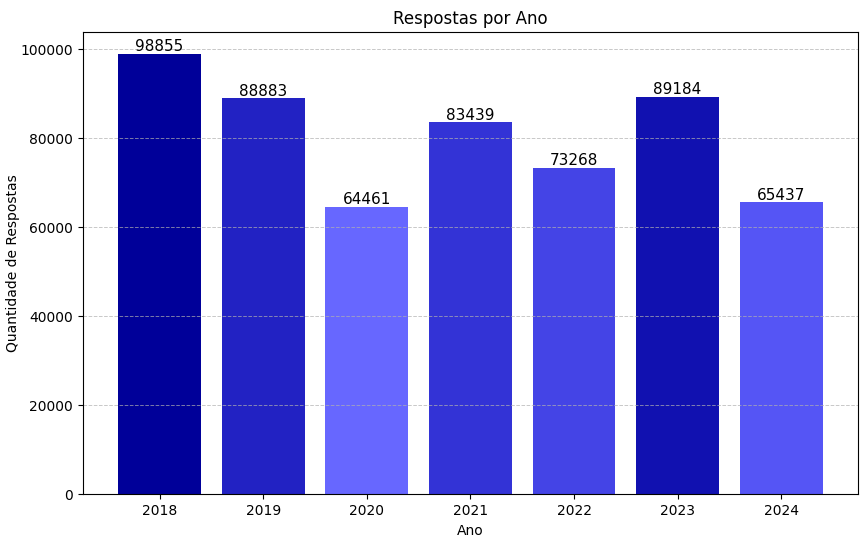
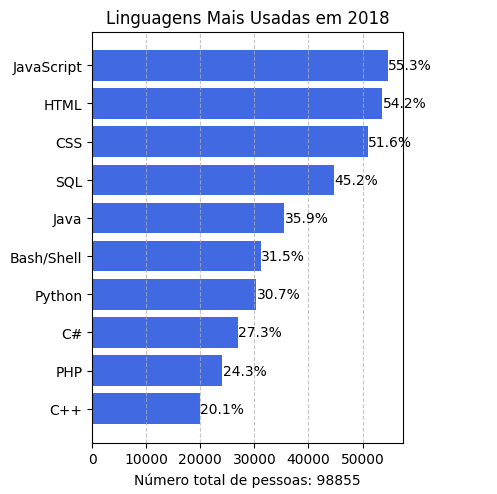
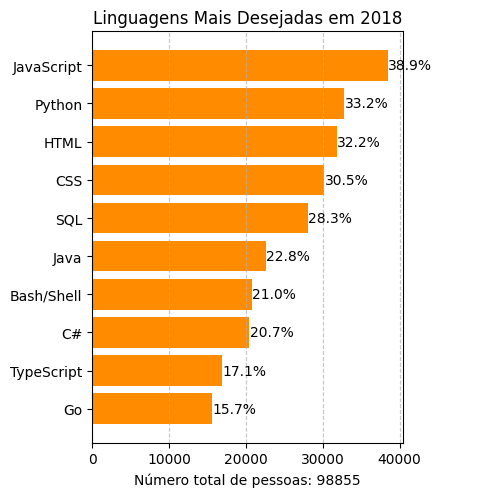
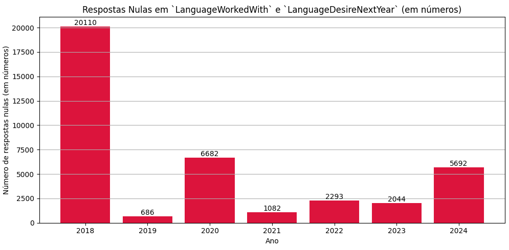
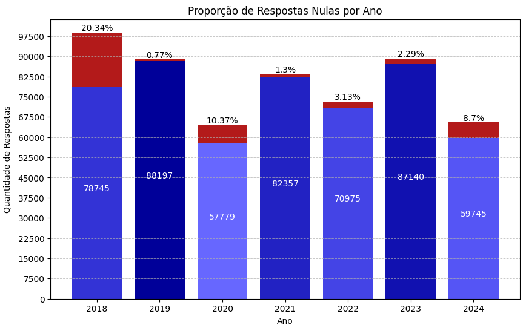

## ETL com pandas e Matplotlib
|Language: | [](https://www.python.org/)|
|-:|:-|
|Libraries: | [](https://pandas.pydata.org/docs/) [](https://matplotlib.org/stable/index.html)|
|IDE: | [](https://colab.research.google.com/) [](https://code.visualstudio.com/)|
|License: | [%201.0-63aa63?style=for-the-badge)](./LICENSE)|


## Índice
- [Sobre](#-sobre)
- [Objetivos](#-objetivos)
- [Etapas](#-etapas)
  - [Extração](#Extração)
  - [Transformação](#Transformação)
- [Gráficos](#-Gráficos)
- [Configurações](#-Configurações)
  - [Instalação](#Instalação)
    - [Local](#para-uso-local)
    - [Colab](#para-uso-em-ambiente-interativo-e-colaborativo)
- [Problemas conhecidos e limitações](#-problemas-conhecidos-e-limitações)
- [Licença](#-licença)


## 🚀 Sobre

#### ETL com pandas e Matplotlib:
  - Processamento e análise de **mais de 560.000** respostas da pesquisa Stack Overflow (2018-2024), extraindo insights sobre tendências em linguagens de programação.
  - Otimização pipeline ETL (Extração, Transformação, Carregamento), reduzindo inconsistências e facilitando análises futuras.
  - Desenvolvimento de um sistema dinâmico de padronização de dados que se adapta a mudanças estruturais em conjuntos de dados ao longo dos anos, garantindo a integridade dos dados e minimizando a intervenção manual.
  - Utilização do pandas para manipular e analisar eficientemente grandes conjuntos de dados, melhorando a flexibilidade e velocidade da análise de dados.
  - Criação de gráficos detalhados usando Matplotlib, permitindo interpretação clara das tendências de adoção de linguagens e a evolução das respostas ao longo do tempo, facilitando insights baseados em dados.
  - Melhora na tomada de decisões na análise de dados, estruturando os resultados para identificar padrões de crescimento e queda de linguagens de programação.

[(Voltar ao topo)](#índice)
## 📝 Objetivos
Mostrar o uso das bibliotecas `pandas` e `Matplotlib` com o propósito de tratamento de dados.
Analisar os dados de tendências no mercado de trabalho na área de tecnologia, de 2018 a 2023 - principais habilidades, ferramentas e linguagens de programação.


[(Voltar ao topo)](#índice)
## 🪜 Etapas
Para ficar mais intuitivo, as etapas serão mostradas de maneira que podem ser replicadas no Google Colab.
"Mostrar etapas do ETL"

### Extração
Representa o acesso inicial aos dados brutos e a preparação para torná-los disponíveis.\
Todos os arquivos de referência foram coletados da [Pesquisa anual de desenvolvedores do Stack Overflow](https://survey.stackoverflow.co/) e estão sobre a [licença](#-licença) ODbL 1.0.

  1. #### Arquivos baixados:
      `stack-overflow-developer-survey-2018.zip`\
      `stack-overflow-developer-survey-2019.zip`\
      `stack-overflow-developer-survey-2020.zip`\
      `stack-overflow-developer-survey-2021.zip`\
      `stack-overflow-developer-survey-2022.zip`\
      `stack-overflow-developer-survey-2023.zip`\
      `stack-overflow-developer-survey-2024.zip`
      ##### Diretório referência: `/SO_DeveloperSurvey_2018-2024/`

  2. #### Arquivos:
      Extrair os arquivos `.zip` e renomear o aquivo `survey_results_public.csv` de cada zip.\
      Todos os arquivos foram renomeados com o seguinte padrão: `survey_results_public_[year].csv`, onde `[year]` corresponde ao ano equivalente.

  3. #### Resultado da preparação:
      `survey_results_public_2018.csv`\
      `survey_results_public_2019.csv`\
      `survey_results_public_2020.csv`\
      `survey_results_public_2021.csv`\
      `survey_results_public_2022.csv`\
      `survey_results_public_2023.csv`\
      `survey_results_public_2024.csv`

### Transformação
A transformação envolve limpar, organizar, reformatar e processar os dados para que fiquem em um formato adequado para análise.
  1. #### Importando as bibliotecas:
     ```python
     import pandas as pd
     import os
     import matplotlib.pyplot as plt
     ```
  2. #### Criando um dicionário para armazenar os DataFrames:
     ```python
     survey_data = {}
     # Caminho para o diretório onde os arquivos estão localizados:
     data_folder = '/content/drive/MyDrive/Colab_Notebooks/SO_DeveloperSurvey_2018-2024'
     ```
  3. #### Criando os DataFrames:
     Comando "os.listdir" para ler todos os arquivos no diretório da variável "data_folder".\
     Extrair o ano do arquivo a partir do comando "split", usando "_" e "." como referências.\
     Usar o nome extraído como chave para o dataset criado e armazenado no dicionário.
     ```python
     for file in os.listdir(data_folder):
       if file.startswith('survey_results_public_') and file.endswith('.csv'):
         year = file.split('_')[-1].split('.')[0]
         survey_data[year] = pd.read_csv(os.path.join(data_folder, file))
     ```
     Exibindo as chaves do dicionário criado:
       ```python
       print(survey_data.keys())
       # output: dict_keys(['2018', '2019', '2020', '2021', '2022', '2023', '2024'])
       ```
  5. #### Identificando o total de respostas por ano:
     ```python
     respostas_por_ano = {} # dicionário criado para armazenar o total de respostas por ano
     for year, df in survey_data.items():
       respostas_por_ano[year] = len(df)
     print(respostas_por_ano) # output: {'2018': 98855, '2019': 88883, '2020': 64461, '2021': 83439, '2022': 73268, '2023': 89184, '2024': 65437}
     ```
     Total de respostas por ano armazenados no dicionário `respostas_por_ano`.
  6. #### Listando as colunas em cada DataFrame:
     ```python
     for year, df in survey_data.items():
       print(f"Colunas presentes em survey_data[{year}]: {', '.join(df.columns)}")
     ```
       Nos `survey_schemas` há a descrição de cada coluna presente nos `survey_data`.\
       Através dessas descrições, identifiquei as colunas relevantes em cada DataFrame:
       > Lista de colunas relevantes em 2018: ` 'LanguageWorkedWith', 'LanguageDesireNextYear'`\
       > Lista de colunas relevantes em 2019: ` 'LanguageWorkedWith', 'LanguageDesireNextYear'`\
       > Lista de colunas relevantes em 2020: ` 'LanguageWorkedWith', 'LanguageDesireNextYear'`\
       > Lista de colunas relevantes em 2021: ` 'LanguageHaveWorkedWith', 'LanguageWantToWorkWith' `\
       > Lista de colunas relevantes em 2022: ` 'LanguageHaveWorkedWith', 'LanguageWantToWorkWith' `\
       > Lista de colunas relevantes em 2023: ` 'LanguageHaveWorkedWith', 'LanguageWantToWorkWith' `\
       > Lista de colunas relevantes em 2024: ` 'LanguageHaveWorkedWith', 'LanguageWantToWorkWith' `

  6. #### Limpando os Dataframes:
     Removendo todas as colunas que não foram identificadas como relevantes.
     Padronizando o nome de todas as colunas. 'LanguageWorkedWith' e 'LanguageHaveWorkedWith' para 'Language', assim como, 'LanguageDesireNextYear' e 'LanguageWantToWorkWith' para 'LanguageWanted'
     ```python
     for year, df in survey_data.items():
       df.drop(columns=[col for col in df.columns if col not in ['LanguageWorkedWith', 'LanguageDesireNextYear', 'LanguageHaveWorkedWith', 'LanguageWantToWorkWith']], inplace=True)
       df = df.rename(columns={'LanguageWorkedWith': 'Language','LanguageDesireNextYear': 'LanguageWanted','LanguageHaveWorkedWith': 'Language','LanguageWantToWorkWith': 'LanguageWanted'}) 
     ```
  
  7. ####
  8. ####
  9. ####
  10. ####
  11. ####

[(Voltar ao topo)](#índice)
## 📈 Gráficos

[](grafico_respostas_porano.png)\
[](linguagens_usadas.gif)
[](linguagens_desejadas.gif)\
[](respostas_nulas_linguagens.gif)
[](grafico_respostas_nulas_empilhadas.gif)

[(Voltar ao topo)](#índice)
## ⚙️ Configurações
Linguagem de programação: Python.
Usei as bibliotecas: `pandas` e `Matplotlib` para coleta, processamento e formatação dos dados e a para gráficos e análise, respectivamente.
Ambiente de Desenvolvimento: Visual Studio Code e Google Colab.

Instalação na próxima seção [Instalação](#instalação).

[(Voltar ao topo)](#índice)
### Instalação
#### Para uso local:
  1. O **Python** pode ser baixado direto de seu [site oficial](https://www.python.org/).
  2. Para **IDE** recomendo o uso do **Visual Studio Code**, baixado direto de seu [site oficial](https://code.visualstudio.com/).
  3. Instalando as bibliotecas:
     ```python
     pip install pandas
     pip install matplotlib
     ```
#### Para uso em ambiente interativo e colaborativo:
  1. O **Google Colab** pode ser utilizado através de seu [site oficial](https://colab.research.google.com/).
  2. Instalando as bibliotecas:
      ```python
      !pip install pandas
      !pip install matplotlib
      ```

[(Voltar ao topo)](#índice)
## 📃 Licença

This database - The Public 2018 Stack Overflow Developer Survey Results - is made available under the Open Database License (ODbL): http://opendatacommons.org/licenses/odbl/1.0/. Any rights in individual contents of the database are licensed under the Database Contents License: [http://opendatacommons.org/licenses/dbcl/1.0/](http://opendatacommons.org/licenses/dbcl/1.0/)\
\
TLDR: You are free to share, adapt, and create derivative works from The Public 2018 Stack Overflow Developer Survey Results as long as you attribute Stack Overflow, keep the database open (if you redistribute it), and continue to share-alike any adapted database under the ODbl.\
\
[Open Database License (ODbL) 1.0](https://github.com/ghiordanobruno/Pred_SODeveloperSurvey/blob/main/LICENSE)
